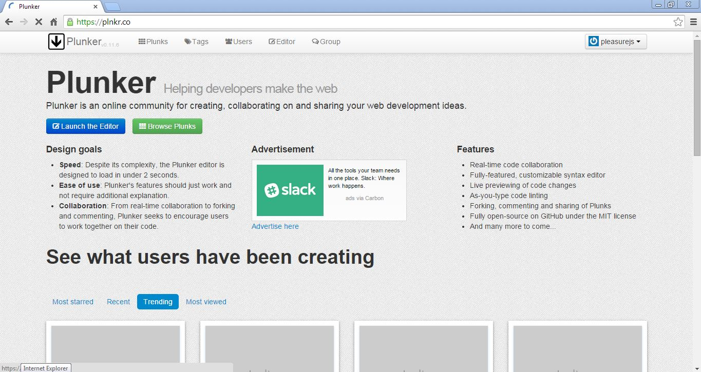

#JavaScript & Big Words


##Why JavaScript?

First things first - Why JavaScript?

But before answering this question, the most important question which pops up into my mind is - Why Programming?

We mostly use our computer, tablet, mobile and television which has been programmed by someone else.

We use applications like Facebook, Twitter, Instagram and many more in our day to day life. We are using them with the features they have given to us.

But what if you need something extra, I mean some customization.

Programming gives you facility to control your computer, tablet, mobile and many other devices. Programming gives you control to write your own Twitter application or may be you can extend Facebook with your own Facebook application.

Dont think you should learn programming only to get a job or good salary. Programming makes you more creative. Programming helps you in transform your imaginations into reality. Programming helps you do more.

Excited to learn programming?

So coming back to the first question - Why JavaScript?

Because JavaScript is one of the most demanding programming language today.

JavaScript is the language of browser. So you can create any of your imaginations in JavaScript and run it on the browser. Using JavaScript you can create web, desktop and mobile applications.

You can use JavaScript to control your laptop, phone, TV, and the servers that power the internet. But you can use JavaScript in hardwares too. Yes! please checkout the projects like [Espruino](https://www.espruino.com/).

JavaScript is everywhere, I mean if you are using Google mail application, JavaScript is there. Its even getting used in YouTube, Linked in, Facebook and many more applications out there.

So using JavaScript you can interact with your users, draw graphics right into the web pages, play audio and video files and do lot more.

This might excite you to start your JavaScript journey. Lets move on and start this journey.

##How JavaScript Works?

We know JavaScript is the language of browser. Its one of the key player used while creating web, mobile or desktop applications. But its not alone, there are two more players who play vital role in JavaScript development.

Who are they? You might already know them.

They are HTML and CSS.

We use HTML to create the FACE of the application, we call it UI, using which a user can interact with the application. HTML stands for HyperText Markup Language which helps us in creating text, images, links, lists, tables and much more. I mean the entire view for our application.

The second player, CSS. We use CSS or Cascading Style Sheets to decorate our HTML pages with colors, fonts, borders, backgrounds and much more. We can use CSS to layout our application. I mean it helps in where to place our HTML elements on the page. Like on left side or right side or center of the page.

JavaScript, you already know adds life to your HTML pages. We use JavaScript to add behaviors to our pages. If you want to validate HTML form on the fly, use JavaScript. You want to load your friends list from Facebook, use JavaScript. You want to draw something like Picasso on the page, use JavaScript. You can use JavaScript to create your own Super Angry Bird game. Almost everything dynamic can be achieved using JavaScript.

So we use triangle of these three technologies to make our dream web or mobile application.

Enough talk! Now lets dive into the world of JavaScript and see how it works.

Lets create a "Hello JavaScript" program.

We will use Plunker throught this book to write our programs - [Plunker](https://plnkr.co/) (https://plnkr.co/).



Click on the __Launch the Editor__ button to launch the Plunker code editor.


You will get the default HTML page created by Plunker. Just replace the code with below HTML snippet.

```html
<!doctype html>

<html lang="en">
<head>
  <meta charset="utf-8">
  <title>Hello JavaScript</title>
</head>

<body>

</body>
</html>
```

We got our first key player, HTML in place. We dont need CSS in this case as it really simple program. Lets focus on JavaScript.

To add life to this page we write JavaScript inside SCRIPT tags. I have added a SCRIPT tag inside HEAD tag:

```html
<!doctype html>

<html lang="en">
<head>
  <meta charset="utf-8">
  <title>Hello JavaScript</title>
  <!-- script block to write JavaScript -->
  <script>
    <!-- Write your JavaScript here -->
  </script>
</head>

<body>

</body>
</html>
```

Lets say Hello to JavaScript using __alert__ function. 

> Dont worry if __function__ sounds new to you, we will discuss it in more details later. 

```html
<script>
  alert('Hello from JavaScript!');
</script>
```

When you run this using __Run__ button in Plunker.


You will see following output in the browser.


You can see a small dialog box saying "Hello from JavaScript!", which is coming automatically when we load this page. I took no action to have this dialog box. I didnt write any HTML or CSS to pop this up at the top of the browser. All of this magic is done by two script tags and the code written between those tags.

So the next question is how this is working?

When this HTML page is loaded, browser start reading the HTML file from top to bottom, left to right. It will start reading from the HTML tag, then the HEAD tag and so on.

When it comes to read the SCRIPT tag, it continues to execute the code inside script tags.

```html
<script>
  alert('Hello from JavaScript!');
</script>
```

Browsers not only read the code, but it compiles the code on the fly using advanced compilation techniques.

This code only works in the lifetime of this page. So if this page is open in one of the tab of the browser, its not going to work in other tabs. If this tab is closed the code is gone.

So you need to add behaviors to your HTML page, add the SCRIPT tags and write the JavaScript into it and your page will be reborn to walk, run and enjoy.


