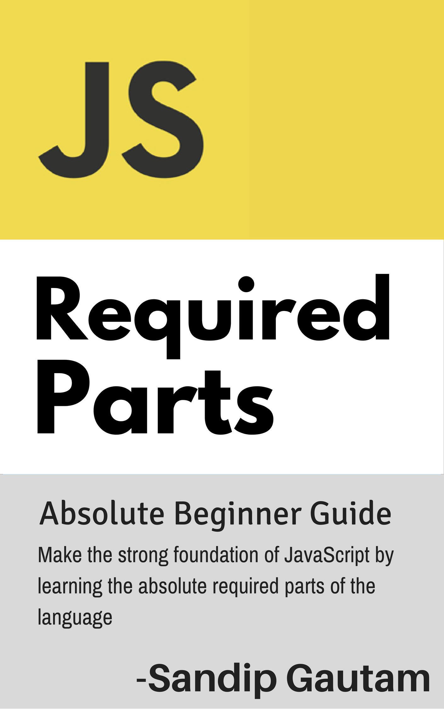

---
# You don't need to edit this file, it's empty on purpose.
# Edit theme's home layout instead if you wanna make some changes
# See: https://jekyllrb.com/docs/themes/#overriding-theme-defaults
layout: home
---

## A Journey from a Beginner to Good JS Programmer
PleasureJS Book Series: A series of JavaScript Books to master coding in JS.

<a href="#" class="book-thumbnail">
    
    JavaScript - Required Parts
</a>